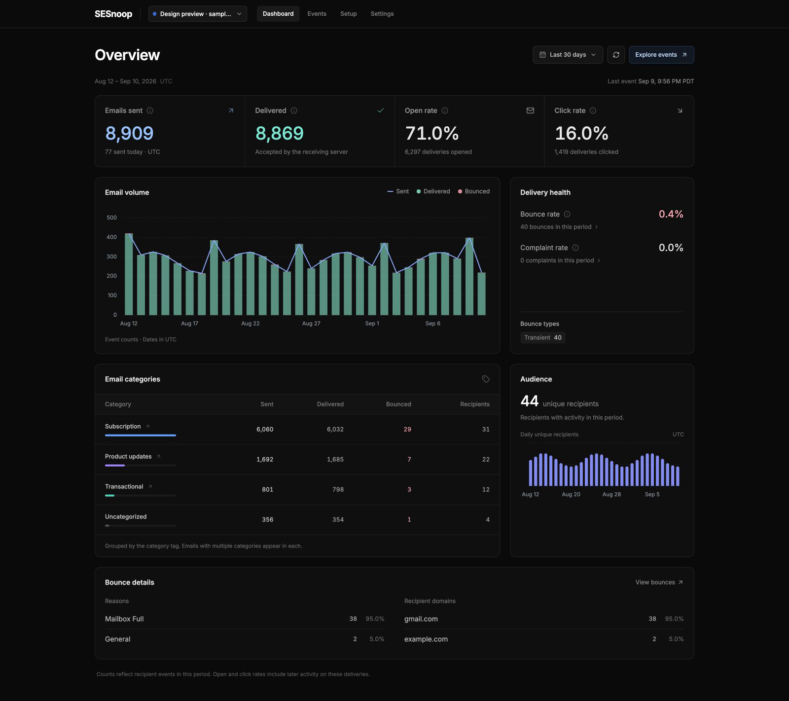
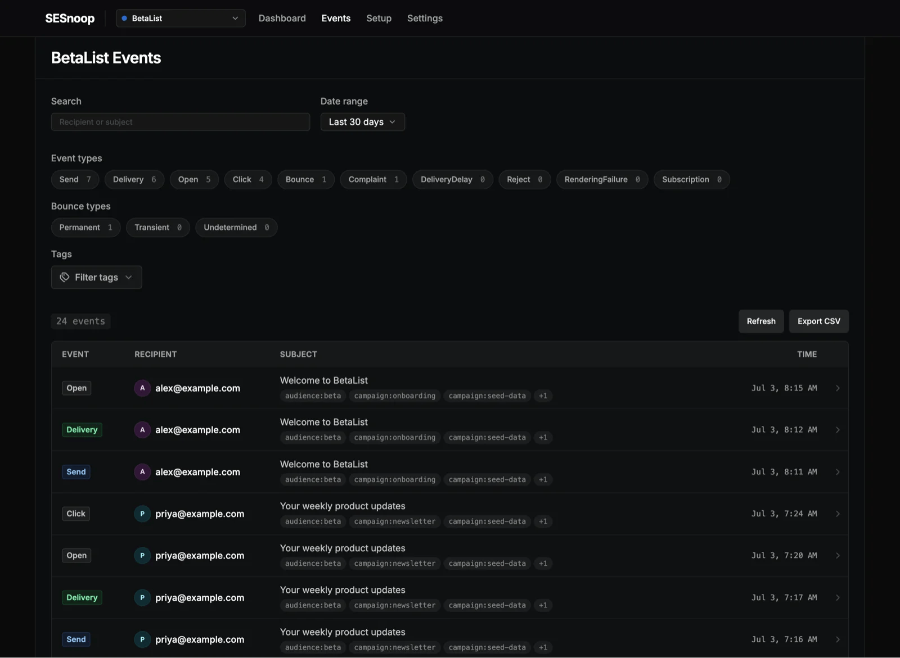

# SESnoop

[](https://deploy.workers.cloudflare.com/?url=https://github.com/scttcper/SESnoop)

SESnoop is a Cloudflare Workers dashboard for Amazon SES event monitoring. It receives Amazon SNS notifications, stores them in D1, and provides a React UI for event search, message timelines, source setup, and delivery metrics.

Based on [marckohlbrugge/sessy](https://github.com/marckohlbrugge/sessy), a Rails app for the same purpose.

|                                                                |                                            |
| -------------------------------------------------------------- | ------------------------------------------ |
|  |  |

## Features

- SNS webhook ingestion with signature verification and SNS message deduplication.
- Searchable SES event history for sends, deliveries, bounces, complaints, rejects, delivery delays, rendering failures, subscriptions, opens, and clicks.
- Message timelines with SES metadata, recipients, tags, and event details.
- Dashboard metrics for volume, delivery health, open/click rates, bounces, complaints, and email categories.
- Multiple sources with separate webhook URLs, colors, and retention policies.
- Optional cookie-based auth for the UI and API.

## Stack

- React, TanStack Router, and TanStack Query for the UI.
- Hono and OpenAPI on Cloudflare Workers for the API.
- Cloudflare D1, SQLite, and Drizzle ORM for storage.

## Deploy to Cloudflare

Prerequisites:

- A Cloudflare account.
- Node.js.
- pnpm `11.9.0`; the repo pins this in `packageManager`.

1. Install dependencies:

   ```bash
   pnpm install
   ```

2. Sign in to Cloudflare:

   ```bash
   pnpm exec wrangler login
   ```

3. Create a D1 database:

   ```bash
   pnpm exec wrangler d1 create sesnoop
   ```

4. Update `wrangler.jsonc`:

   - Set `d1_databases[0].database_id` to the ID returned by Wrangler.
   - Keep the binding name as `DB`.

5. Optional: set auth secrets:

   ```bash
   pnpm exec wrangler secret put AUTH_USERNAME
   pnpm exec wrangler secret put AUTH_PASSWORD
   pnpm exec wrangler secret put AUTH_JWT_SECRET
   ```

6. Deploy:

   ```bash
   pnpm deploy
   ```

   The deploy script builds the UI, applies remote D1 migrations to the `DB` binding, and deploys the Worker.

## Connect SES

After deployment:

1. Open the SESnoop dashboard.
2. Go to **Sources** and create a source.
3. Click **Setup** for that source.
4. Use the generated SNS topic name, SES configuration set name, and webhook URL to configure Amazon SES.

The webhook URL has this shape:

```text
https://<your-worker>/api/webhooks/<source_token>
```

For lower webhook and D1 usage, start with delivery, bounce, complaint, reject, delivery delay, and rendering failure events. Enable open, click, and subscription events only if you need engagement data.

SESnoop handles SNS `SubscriptionConfirmation` requests automatically.

## Local Development

1. Install dependencies:

   ```bash
   pnpm install
   ```

2. Optional: enable local auth:

   ```bash
   cp .env.example .dev.vars
   ```

   This uses the sample `admin` / `admin` login. Leave `.dev.vars` absent to run locally without auth, or replace the values with your own.
   `.dev.vars` is ignored by git; do not commit real secrets.

3. Apply the D1 schema to the local database:

   ```bash
   pnpm exec wrangler d1 migrations apply DB --local
   ```

4. Optional: load seed data:

   ```bash
   pnpm db:seed
   ```

5. Start the app:

   ```bash
   pnpm dev
   ```

   Open the Vite URL printed in the terminal, usually `http://localhost:5173`.

### Clone remote D1 to local (for testing)

For a throwaway local copy of remote data, apply the local schema first, then import a data-only export:

```bash
pnpm exec wrangler d1 migrations apply DB --local
pnpm exec wrangler d1 export sesnoop --remote --no-schema --output .wrangler/remote-d1-data.sql
pnpm exec wrangler d1 execute DB --local --file .wrangler/remote-d1-data.sql
```

Use a fresh local D1 state when possible; existing local rows may conflict with imported IDs. The export can contain real email metadata, so keep it out of git and delete it when done.

## Configuration

Set these in `.dev.vars` for local development or with `wrangler secret put` for production.

Auth is disabled unless both `AUTH_USERNAME` and `AUTH_PASSWORD` are set. If they are set, `AUTH_JWT_SECRET` is required.

| Variable                  | Description                                                        |
| ------------------------- | ------------------------------------------------------------------ |
| `AUTH_USERNAME`           | Username for cookie-based auth.                                    |
| `AUTH_PASSWORD`           | Password for cookie-based auth.                                    |
| `AUTH_JWT_SECRET`         | Secret used to sign auth cookies.                                  |
| `AUTH_COOKIE_NAME`        | Optional cookie name. Defaults to `sesnoop_auth`.                  |
| `AUTH_COOKIE_TTL_SECONDS` | Optional cookie lifetime. Defaults to 30 days.                     |
| `IGNORED_SES_EVENT_TYPES` | Optional comma-separated event types to acknowledge but not store. |

Each source also has an optional retention period. When set, the scheduled Worker deletes that source's messages and events older than the retention window. Without a retention period, data is kept indefinitely.

## Cloudflare Notes

- `wrangler.jsonc` is the source of truth for the Worker name, assets, D1 binding, cron trigger, and observability settings.
- Keep the D1 binding name as `DB`; the app, migrations, and generated Cloudflare types expect it.
- Static assets are served by Cloudflare Workers assets with SPA fallback, while `/api/*` routes run through the Worker first.
- Retention cleanup runs from the configured cron trigger at 02:00 UTC daily.
- To inspect remote migration state, run `pnpm exec wrangler d1 migrations list DB --remote`.
- To stream deployed Worker logs, run `pnpm exec wrangler tail sesnoop`.

## API Reference

- OpenAPI JSON: `/api/doc`
- Scalar API reference: `/api/reference`

Useful endpoints:

| Endpoint                            | Purpose                       |
| ----------------------------------- | ----------------------------- |
| `GET /api/sources/:id/events`       | Search and filter events.     |
| `GET /api/sources/:id/overview`     | Read dashboard metrics.       |
| `GET /api/sources/:id/messages/:id` | Read one message timeline.    |
| `POST /api/webhooks/:source_token`  | Receive SNS webhook payloads. |

## Scripts

| Command               | Description                        |
| --------------------- | ---------------------------------- |
| `pnpm dev`            | Run the local Vite and Worker app. |
| `pnpm build`          | Build the React UI.                |
| `pnpm preview`        | Build and preview locally.         |
| `pnpm deploy`         | Build, migrate remote D1, deploy.  |
| `pnpm test`           | Run the Vitest suite.              |
| `pnpm test -- <file>` | Run one test file.                 |
| `pnpm typecheck`      | Run TypeScript checks.             |
| `pnpm lint`           | Run lint and format checks.        |
| `pnpm cf-typegen`     | Generate Cloudflare binding types. |
| `pnpm db:seed`        | Seed the local D1 database.        |
